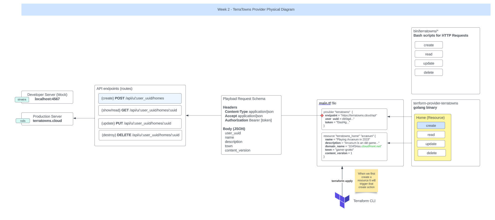

# Terraform Beginner Bootcamp 2023 - Week 2


## TerraTowns Provider Physical Diagram


## Anatomy of a Request


## Working with Ruby

### Bundler

Bundler is a package manager for ruby.
This is the primary way to install ruby packages (known as gems) for ruby.

#### Install Gems

You need to create a Gemfile and define your gems in that file.

[source](https://rubygems.org) 

```rb
gem 'sinatra'
gem 'rake'
gem 'pry'
gem 'puma'
gem 'activerecord'
```

Then you need to run the `bundle install` command

This will install the gems on the system globally (unlike nodejs which install packages in place in a folder called node_modules)

A Gemfile.lock will be created to lock down the gem versions used in this project.

#### Executing ruby scripts in the context of bundler

We have to use `bundle exec` to tell future ruby scripts to use the gems we installed. This is the way we set context.


## Terratowns Mock Server
We use a mock server to simulate the production server. Using the mock server we can deploy and trouble shoot our terraform provider. 

### Sinatra

Sinatra is a micro web-framework for ruby to build web-apps.

Its great for mock or development servers or for very simple projects.

You can create a web-server in a single file.

[Sinatra](https://sinatrarb.com/)

### Running the web server

We can run the web server by executing the following commands:

```rb
bundle install
bundle exec ruby server.rb
```

The code for the server is stored in the `server.rb` file.

## CRUD

Terraform Provider resources utilize CRUD.

CRUD stands for Create, Read Update, and Delete


https://en.wikipedia.org/wiki/Create,_read,_update_and_delete


## Getting Started with Golang

### 1. Install Go:
The first step is to install Go on your computer. You can download the latest official distribution from the [Go website](https://golang.org/dl/) and follow the installation instructions for your specific operating system.

### 2. Set Up Your Workspace:
Go uses a specific directory structure known as the "workspace." Inside your workspace, you will organize your Go code and dependencies. The workspace typically has three directories: src (source code), bin (compiled binaries), and pkg (package files).

Go expects you to have a single workspace for all your Go code. By default, your workspace is located at a directory called go in your home directory.

### 3. Writing Your First Go Program:
Create a new directory inside your workspace's src directory to organize your project. For example, if you're creating a simple "Hello World" program, you might do the following:

```shell
mkdir -p ~/go/src/hello

```

Inside the hello directory, create a Go source code file (with a .go extension), for example, hello.go. In this file, you can write your Go code. Here's a basic "Hello World" program:

```go
package main

import "fmt"

func main() {
    fmt.Println("Hello, World!")
}

```

### 4. Compile and Run Your Go Program:
You can compile and run your Go program by using the go command. Open a terminal, navigate to your project directory, and then run the following commands:

```shell
go build  # This compiles your program
./hello    # This runs the compiled binary
```

Replace hello with the name of your program if you named it differently.

### 5. Learn the Basics:
As you get comfortable with writing and running Go programs, it's essential to learn the fundamentals of the language. You can refer to the official Go tutorial and documentation, which is a great resource for beginners:

### 6. Official Go Tour: An interactive tour of Go that covers its syntax and features.
Official Go Documentation: The Go documentation includes an introduction, effective Go tips, and detailed language specifications.
Explore Go Packages:
Go has a rich standard library, and you can use various packages to simplify your development tasks. Take the time to explore the standard library and popular third-party packages available on the [Go Package Documentation](https://pkg.go.dev/).

### 7. Practice and Build Projects:
The best way to learn Go is by working on projects. Start with small projects and gradually build more complex applications to gain hands-on experience.

### 8. Community and Resources:
Join the Go community by participating in forums like the official [Go forum](https://forum.golangbridge.org/) and exploring online resources, blogs, and books dedicated to Go programming.

Getting started with Go is an exciting journey, and it's known for its simplicity, performance, and strong support for concurrent programming. Enjoy your exploration of the Go programming language!

## Building the Skeleton for the Custom Terraform Provider

- Install Go and set up a Go workspace.
- Install Terraform.
- Create a New Go Module:
- Initialize a new Go module for your custom provider project.

```shell
go mod init <module-name>
```

Write Provider Code:


- Create a Go source code file for the custom provider. ```main.go``` .

```go
package main
import "fmt"
func main ()
{
    fmt.PrintIn("Hello, World")
}

```
- Define a schema for the "Hello World" resource.
- Implement CRUD operations (Create, Read, Update, Delete) for the "Hello World" resource.


- Implement the Provider Configuration:

Define a configuration structure for your provider, including any authentication or connection details required

Write Terraform Resource and Data Source Definitions:

Define Terraform resource and data source blocks in the .tf configuration files, specifying how they interact with your provider.

```hcl
resource "example_hello_world" "my_resource" {
  message = "Hello, World!"
}
```
Implement the Provider's Resource Functions:

Implement the provider functions for CRUD operations using the Terraform SDK.
